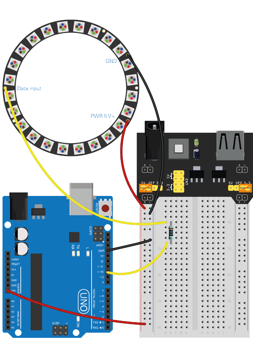

# Neopixel Second
This program turns on and off the LED lights of the Neopixel in a pattern. The program is written to turn on the LED lights in order, one after the other, from the first to the last LED. Then it turns off the lights in order. This occurs at an interval set in milliseconds. It gives the illusion that the lights are “moving” or “following” in a ring pattern. 

Connection scheme:

_Illustrasjon laget med komponenter fra Fritzing (fritzing.org). CC BY-SA 3.0_ - Kjell and Company

Demo (GIF):

Source: [Lys opp med Neopixel - Arduino-prosjekt | Kjell.com](https://www.kjell.com/no/spor-kjell/hvordan-virker-det/arduino/arduino-prosjekt/lys-opp-med-neopixel)

