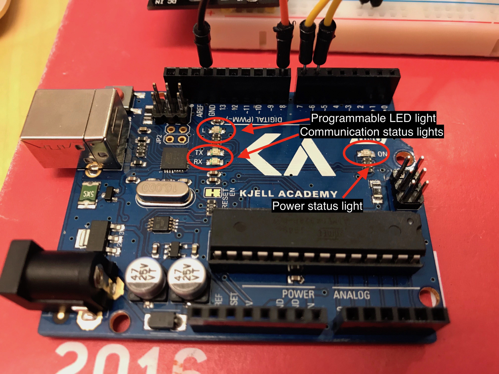
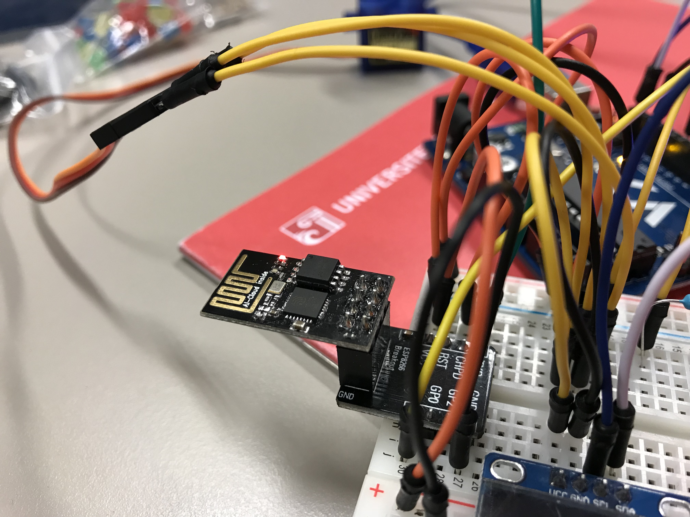

# BlinkLED
## For testing communication with Arduino and configuring WiFi Module
BlinkLED does what it says: turns on and off (blinks) the small LED light on the Arduino Uno. 

Use the BlinkLED.ino program in this folder to configure the WiFi Module pictured below (ESP8266 with breakout board):

Connection scheme:

Illustrasjon laget med komponenter fra Fritzing (fritzing.org). CC BY-SA 3.0 - Kjell and Company

By default the WiFi module is configured to communicate at 115 200 Bd (Baud Rate), but Software Serial only works at 9600 Bd. We need to reconfigure the WiFi module to use it in other projects. 

1. Connect the WiFi module as specified in the image above. 
2. Upload the BlinkLED sketch (Arduino IDE)
3. Open Serial Monitor 
4. Type “AT” and press send. Arduino should respond OK. Make sure the Bd is set to 115200

You will now need to configure the WiFi module to communicate at 9600 Bd. This will allow the module to work on other pins besides 0 and 1 (RX and TX). 

In Serial Monitor send the following to Arduino:
`AT+UAR_DEF=9600,8,1,0,0` 

Then change the Serial Monitor to 9600 Bd and type AT once more. If you get the OK response then everything is working correctly. 

Source: 
[Koble Arduino til wifi - Arduino-prosjekt | Kjell.com](https://www.kjell.com/no/spor-kjell/hvordan-virker-det/arduino/arduino-prosjekt/koble-arduino-til-wifi) 

