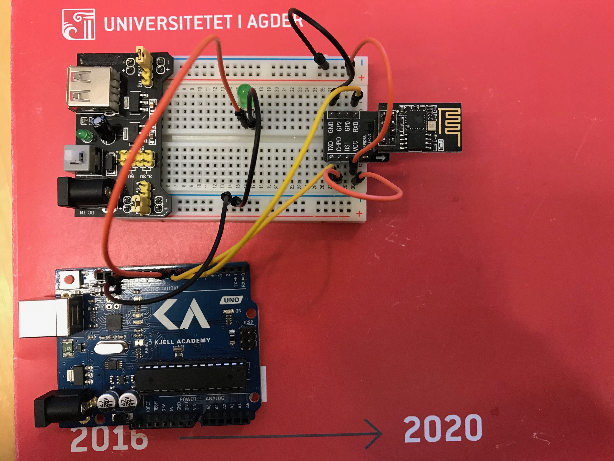
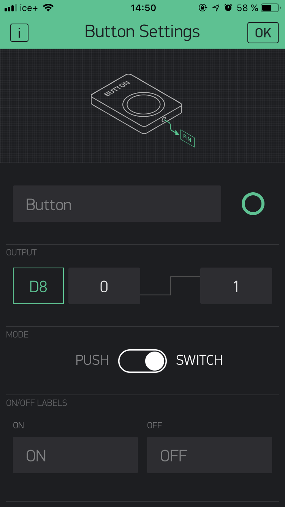

# BlynkBlink - control LED over WiFi
This implementation uses only the Blynk libraries for WiFi and pin controls. Using a unique auth-token it is possible to control a number of functions on the Arduino in the Blynk app (Android / iOS). In the app we can define which pins to control, and the behaviour.  The biggest issue with Blynk is the limited documentation and poor debugging features. This caused a lot of headaches when attempting to start the WiFi module. 

To use this code:
1. Edit the program to use your own Blynk auth-token (auth-token is generated in the Blynk iOS / Android app)
2. Configure the Blynk app to turn on and off D8 (or any other pin) where the light is connected. 

The connection scheme follows the original WiFi connection scheme (see  BlinkLED scheme. A connected example is shown below:

Blynk app:

Demo images: 
We where unfortunately not able to show take demo images, because our WiFi module burnt out before we had a chance to take pictures. Given that your WiFi module is able to start and connect however, then this code will work just fine.

Source: [Blynk](https://www.blynk.cc)
