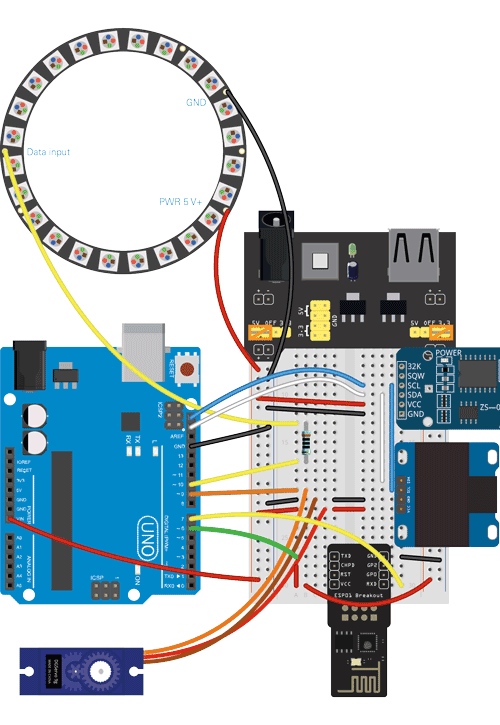
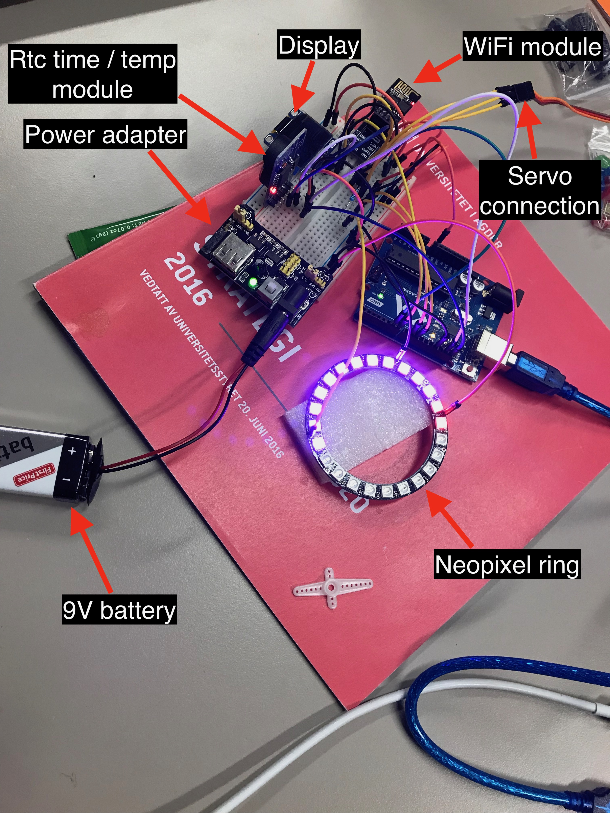
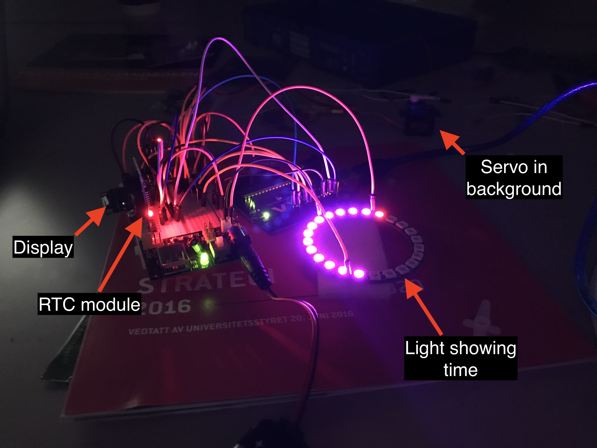
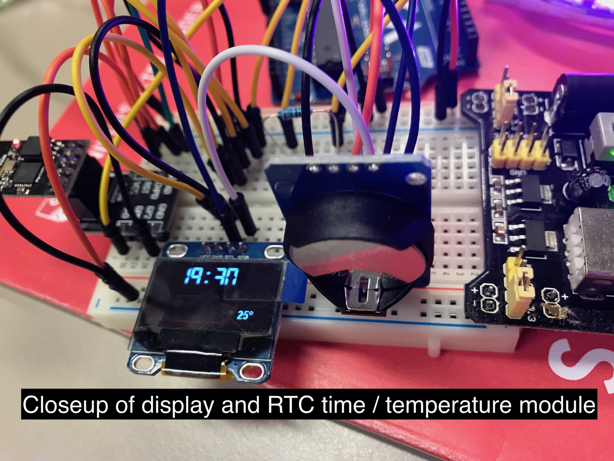

# GrandeFinale book project
This project is based on the “Kjell and Company” IoT project. The idea is simple: 
1. Show time and current environment temperature on the display
2. Represent time on the Neopixel ring. 
3. Represent temperature on the servo motor (with a scale drawn to know what the servo is trying to represent).
4. Upload temperature in intervals to Thingspeak to keep track of temperature changes over time. 
5. Show on the display when data was last uploaded. 

Sample data from Thingspeak: [Thingsspeak Public Data](https://thingspeak.com/channels/621187)

Connection scheme:

_Illustrasjon laget med komponenter fra Fritzing (fritzing.org). CC BY-SA 3.0_ - Kjell and Company

Demo images: 

Source: [Bygge et internettilkoblet klokketermometer - Arduino-prosjekt | Kjell.com](https://www.kjell.com/no/spor-kjell/hvordan-virker-det/arduino/arduino-prosjekt/bygge-et-internettilkoblet-klokketermometer)

