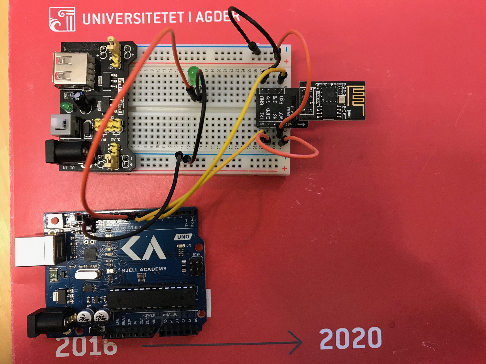
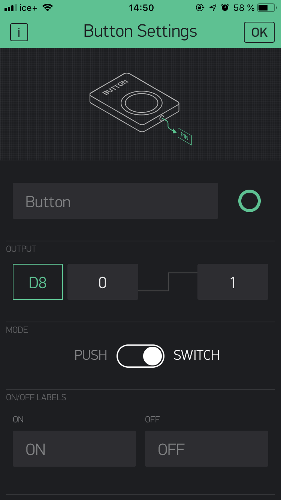

# WifiBlynk - ESP library combined with Blynk to control LED
This implementation uses the Blynk library and app to control the light, just like BlynkBlink, but uses instead the ESP8266 WiFi connection implementation. This is to return more meaningful connection information, such as WiFi shield status, IP-address and whether the connection has been completed before Blynk attempts to connect to the Auth Token.

Blynk app:

Demo images: 
We where unfortunately not able to show take demo images, because our WiFi module burnt out before we had a chance to take pictures. Given that your WiFi module is able to start and connect however, then this code will work just fine.

Sources: 

[Blynk](https://www.blynk.cc)
[Koble Arduino til wifi - Arduino-prosjekt | Kjell.com](https://www.kjell.com/no/spor-kjell/hvordan-virker-det/arduino/arduino-prosjekt/koble-arduino-til-wifi)
